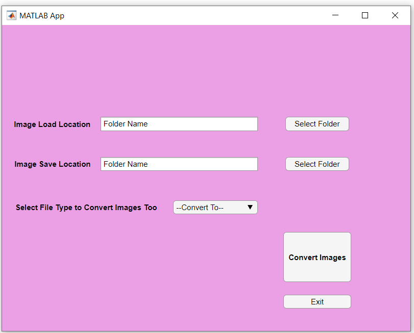
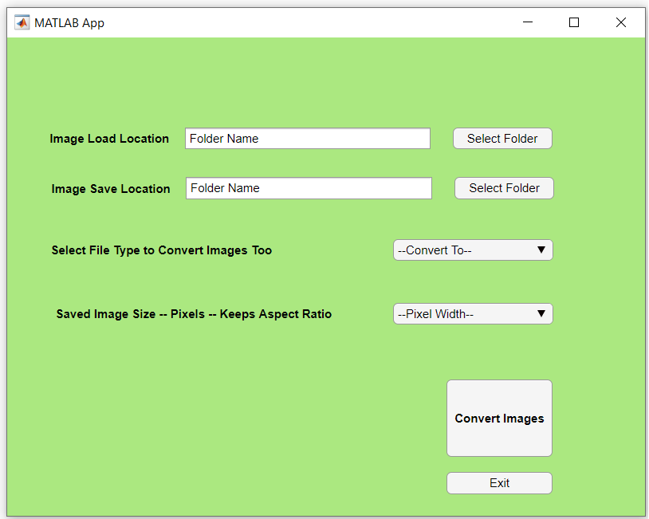

# image_conversion_and_resizing_matlab
GUIs and Apps written in Matlab designed to allow for easy type conversion and resizing of images across a range of file types.

The programs include GUIs which allow for the selection of a range of options for image conversion and resizing. This conversion is applied to all images in a selected folder, with the converted images being saved in a further specified directory.

Versions of the program have been made for pure image type conversion (not recommended for use due to a less refined method of loading and saving images):

and (recommended) for both image type conversion and resizing across all images in the selected folder:

